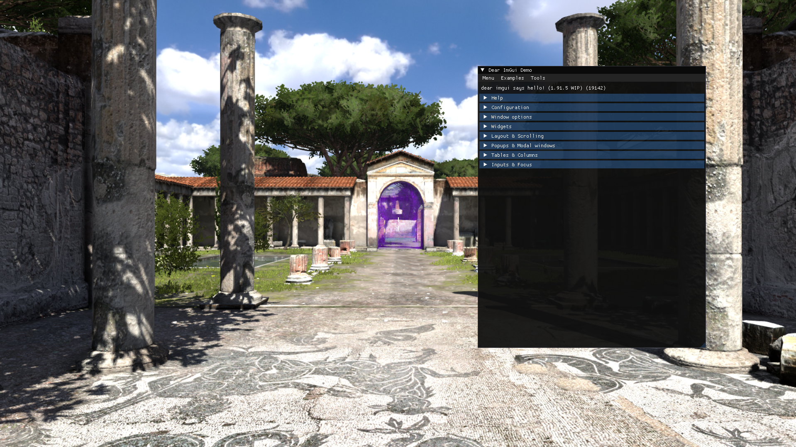

# DirectHook
**DirectHook** is a library designed to intercept and modify DirectX API function calls, making it ideal for tasks like implementing ImGui overlays or custom graphics monitoring within applications.

### Supported APIs
DirectHook currently supports the following DirectX APIs:
- Direct3D 9, 10, 11, 12
- DirectDraw 7

### Planned Features
- **Cross-API Support**: Future versions may add support for non-DirectX graphics APIs such as OpenGL and Vulkan.

## Getting Started

### Samples
The **Samples** folder provides basic DLLs for each supported API, demonstrating DirectHook’s capabilities to intercept API function calls. Each sample includes:

- **Function Hooking**: Basic hooks for common DirectX functions.
- **ImGui Integration**: Samples show how to use DirectHook to implement an ImGui overlay, enabling custom in-game interfaces. 

#### Sample Usage
To test a sample, you have two options:

1. Use the provided `DLLInjector` tool. This requires specifying the target process and the DLL path as command-line arguments:
    ```sh
    DLLInjector.exe D3D11App.exe D3D11Hook.dll
    ```

2. For quick testing, directly add the DLL load call in your application code:
    ```cpp
    LoadLibrary(L"D3D11Hook.dll");
    ```

### API Utilities
DirectHook provides two utility headers for each supported API:

- **Hook Indices**: Enumerations that help you specify which function to intercept.
- **Function Type Definitions**: Convenient typedefs for function pointers, making it easy to define custom functions that match DirectX’s API function signatures.

## Example: D3D11 Hook

The following example demonstrates how to use DirectHook to intercept the `Present` function in Direct3D 11, allowing for custom behavior on each frame render. This example could be extended to implement an ImGui overlay.

1. **Hook Indices**: Enumerated constants to specify the function to intercept:
```cpp
namespace directhook::d3d11
{
    enum {
       // Other indices...
       SwapChain_Present = 8, // Index for Present call
       // Other indices...
    };
}
```
2. **Function Typedefs**: Aliases to simplify function pointer declarations:
```cpp
namespace directhook::d3d11 {
    // Other typedefs...
    using PFN_DXGISwapChain_Present = HRESULT(STDMETHODCALLTYPE*)(IDXGISwapChain*, UINT, UINT);
    // Other typedefs...
}
```
3. **Hook Implementation**: Intercept `Present` call to add custom behavior.
```cpp
#include "directhook.h"
using namespace directhook;

static d3d11::PFN_DXGISwapChain_Present dxgiPresent = nullptr;

HRESULT STDMETHODCALLTYPE MyPresent(IDXGISwapChain* SwapChain, UINT SyncInterval, UINT Flags) {
    static BOOL called = FALSE;
    if (!called) {
       MessageBoxA(0, "Called MyPresent!", "DirectHook", MB_OK);
       called = TRUE;
    }
    return dxgiPresent(SwapChain, SyncInterval, Flags);
}

INT D3D11HookThread() {
    if (DH_Status dh = DH_Initialize(); dh == Status::Success) {
       Hook(d3d11::SwapChain_Present, dxgiPresent, MyPresent);
    }
    return 0;
}

BOOL WINAPI DllMain(HINSTANCE hInstance, DWORD fdwReason, LPVOID) {
    DisableThreadLibraryCalls(hInstance);
    if (fdwReason == DLL_PROCESS_ATTACH) {
       CreateThread(NULL, 0, (LPTHREAD_START_ROUTINE)D3D11HookThread, NULL, 0, NULL);
    }
    return TRUE;
}
```
## Usage Guide

1. **Integrate DirectHook**: Add the DirectHook source folder to your DLL project.
2. **MinHook Dependency**: Link to MinHook libraries or add MinHook source code directly to your project.
3. **Select Graphics API**: Define the graphics API you’re targeting with the relevant `DH_USE_*` macro:
   - **In Visual Studio**: Go to `Project -> Properties -> C/C++ -> Preprocessor -> Preprocessor Definitions` and add the desired macro.
   - **In CMake**: Use `target_compile_definitions(MyDLL PRIVATE DH_USE_*)`.
   - **Direct Declaration**: Alternatively, add the macro at the top of `directhook.h`.
  
## Screenshots
### The Talos Principle (D3D11)
 

### S.T.A.L.K.E.R. 2: Heart of Chornobyl (D3D12 UE 5.1)
 